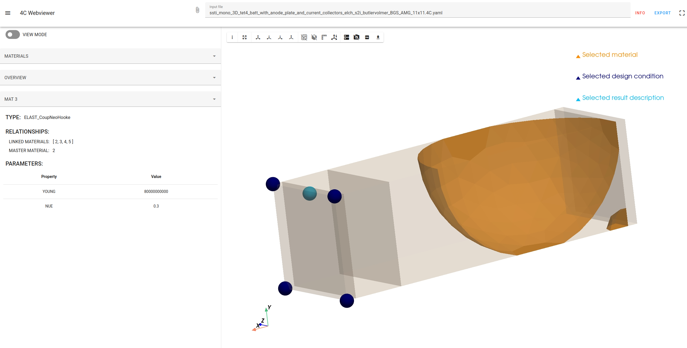

<div align="center">
<picture>
  <source media="(prefers-color-scheme: dark)" srcset="images/4C-logo/negative-white/4C-logo-landscape_negative.svg">
  <source media="(prefers-color-scheme: light)" srcset="images/4C-logo/standard-color/4C-logo-landscape_rgb.svg">
  
</picture>
</div>

<h1 align="center">
  4C-Webviewer
</h1>

The **4C-Webviewer** is designed to visualize and edit the input of [4C](https://github.com/4C-multiphysics/4C). Instead of working with the text-based YAML input files directly, users can view and interact with the geometry of the problem they want to solve using **4C** within their browser.

Beyond visualization of the geometry, the webviewer helps users to explore material and boundary condition assignments, including any functions defined through them. This offers a more transparent and efficient way to understand and adjust the simulation setup.

Below we show a first impression on how the **4C-Webviewer** looks like:



## Overview
- [Installation](#installation)
- [Using the 4C-Webviewer](#using-the-4c-webviewer)
- [Dependency Management](#dependency-management)
- [Disclaimer](#disclaimer)
- [License](#license)

## Installation

An Anaconda/Miniconda environment is highly recommended to install the required dependencies. After installing Anaconda/Miniconda execute the following steps:

```bash
conda create -n 4c-webviewer python=3.12
```

Navigate to the source directory and activate the newly created environment:
```bash
conda activate 4c-webviewer
```

Install all requirements with:
```bash
conda install -c conda-forge vtk=9.4.2
pip install -e .
```

If you plan to develop the 4C-Webviewer, it is advisable to also install the pre-commit hook with:
```bash
pre-commit install
```

## Using the 4C-Webviewer

To start the webviewer, in the conda environment run:
```
fourc_webviewer
```
To directly open a YAML input file use
```
fourc_webviewer --fourc_yaml_file <path-to-4C-YAML-input-file>
```

Alternatively change to the directory of the repo. Activate the created conda environment and run
```
python main.py
```

## Dependency Management

To ease the dependency update process [`pip-tools`](https://github.com/jazzband/pip-tools) is utilized. To create the necessary [`requirements.txt`](./requirements.txt) file simply execute

```
pip-compile --all-extras --output-file=requirements.txt requirements.in
````

To upgrade the dependencies simply execute

```
pip-compile --all-extras --output-file=requirements.txt --upgrade requirements.in
````

## Disclaimer

Please note that this project is still at an early stage of development.

We encourage you to test the current state and provide feedback on what functionality would help you by adding to the corresponding [issue](https://github.com/4C-multiphysics/4C-webviewer/issues/1) or even contributing to the progress yourself.


## License

This project is licensed under a MIT license. For further information check [`LICENSE`](./LICENSE).
